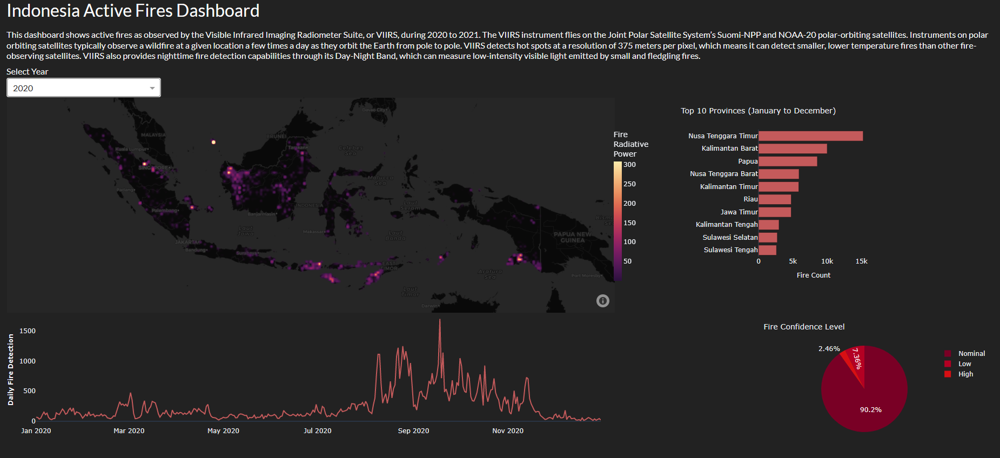

# Indonesia Active Fire Dashboard

This comprehensive dashboard provides a visual representation of active fires that occurred in Indonesia from January 2020 to December 2021. The data utilized in this dashboard is sourced from the Visible Infrared Imaging Radiometer Suite (VIIRS) by NASA.

<b>Features</b>
* Density Map: Explore the distribution of active fire locations across Indonesia through an interactive density map.
* Top Fire-Prone Provinces: Gain insights into the provinces with the highest frequency of fire occurrences.
* Daily Fire Detections: Track the daily count of fire detections to identify patterns and trends.
* Confidence Levels: Analyze the confidence levels associated with the detected fires to assess their reliability.

<b>Preview</b>
